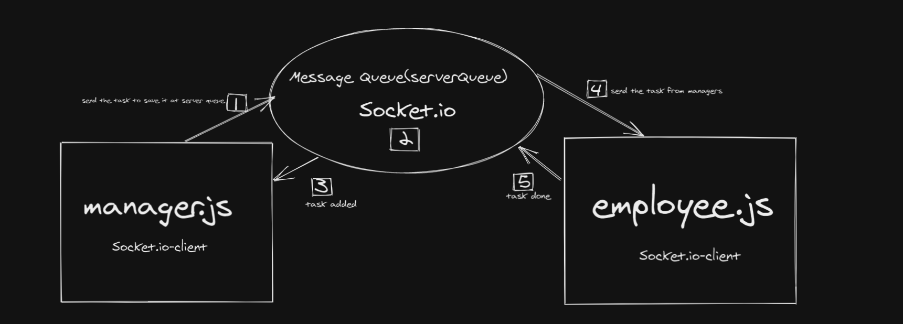
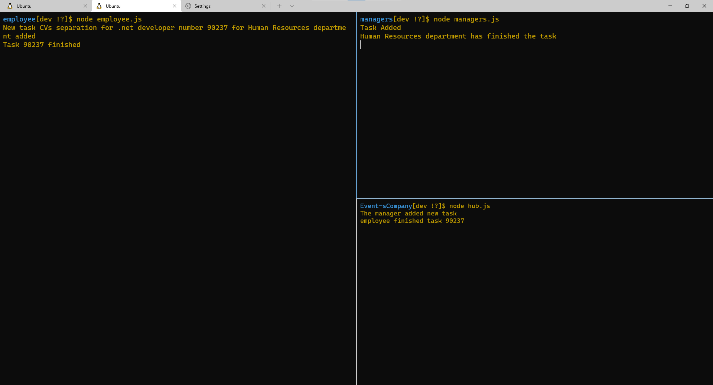
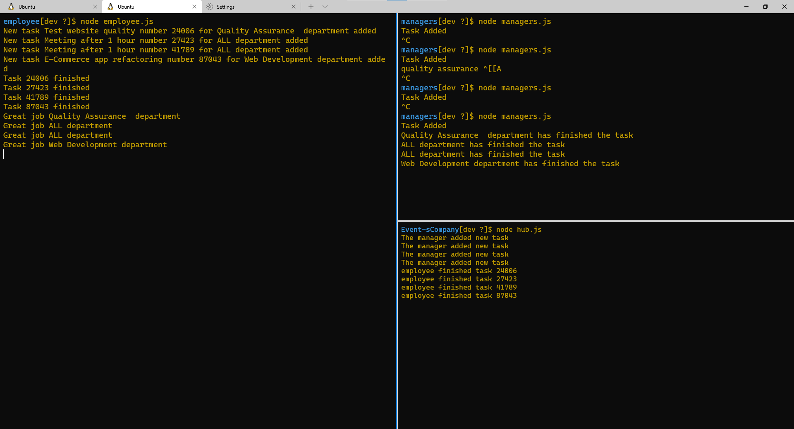

# Event's-Company

## Lab 14
## Author: 
- Rami Zregat
- Wesam Al-Qawasmeh
- Nedal Al-Saleh
- Dima Alabsi
- Samah Hamed

**Description of the lab:**  
Create a new application using real-time events for executing, and presenting an application that showcases an event driven architecture.
programming concepts:
- A “hub” server that moderates all events.
- Multiple “clients” that connect to the hub which can .both publish and subscribe to events
- Must operate over a network.

## UML

## Links to check:

- Github pull request link: https://github.com/RamiZregat/Event-sCompany/pull/1

## Dependencies:  

- dotenv
- faker
- socket.io
- socket.io-client

## How to start the application:  
- node hub.js
- node managers.js
- node employee.js

## Output result
 ### Start all 3 servers:
 

 ### Stop one of your applications servers:
 